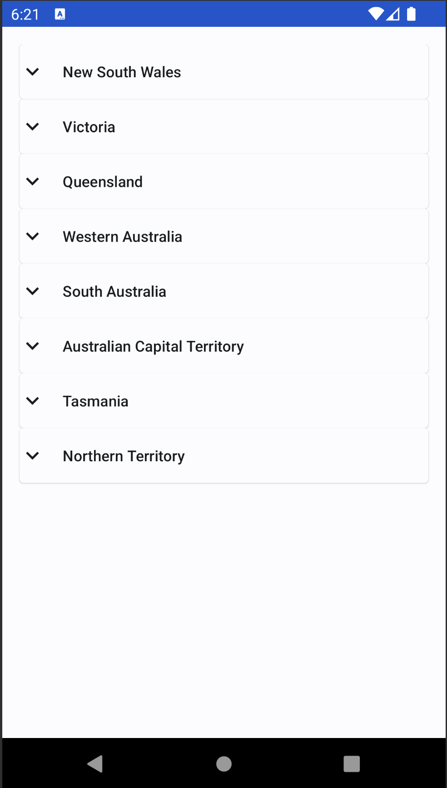
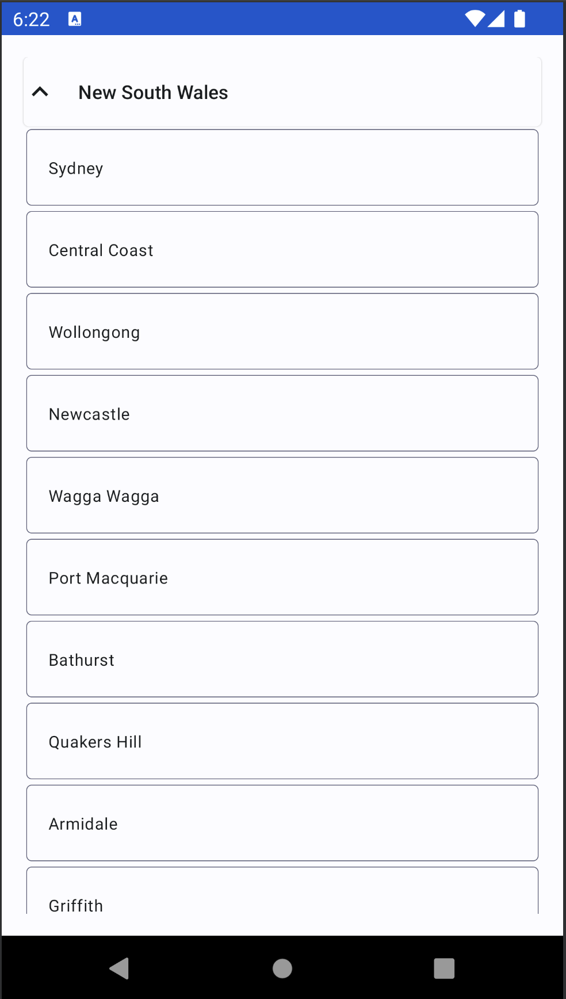
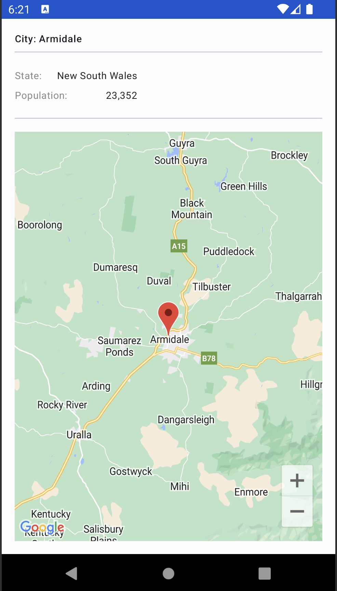

# City Explorer App

The **City Explorer App** is an Android application that allows users to explore a list of cities and view detailed information about each city.

## Table of Contents

- [Features](#features)
- [Demo](#demo)
- [Screenshots](#screenshots)
- [Getting Started](#getting-started)
- [Prerequisites](#prerequisites)
- [Running Android Tests](#android-tests)
- [Running Unit Tests](#unit-tests)
- [Installation](#installation)
- [Usage](#usage)

## Features

- List view of cities grouped by state.
- Expandable sections to view cities within each state.
- Pagination for loading more cities.
- City details screen displaying information such as latitude, longitude, state, and population.
- Back navigation from the details screen.
- Material Design components for a visually pleasing user interface.

## Demo

You can watch a demo of the City Explorer App in action:

<video controls width="640">
  <source src="screenshots/demo.mov" type="video/mov">
  Your browser does not support the video tag.
</video>

## Screenshots





## Getting Started

Follow these instructions to get a copy of the project up and running on your local machine for development and testing purposes.

### Prerequisites

- Android Studio (latest version)
- Android SDK with API level 33 or higher


### Running Android Tests (UI Tests)

1. Start an Android Emulator or Connect a Device: Ensure you have an Android emulator running or a physical device connected.
2. Navigate to androidTests: In the "Project" view. 
3. Right-click on the androidTest directory.
4. Select "Run 'Tests in 'androidTest''".
5. View Results: After execution, check test results in the "Run" tab.

### Running Unit Tests

1. Navigate to Tests: In the "Project" view.
2. Right-click on the test directory
3. Select "Run 'Tests in 'test''".
4. View Results: After execution, check test results in the "Run" tab.

### Installation

1. Clone the repository to your local machine:

   ```shell
   git clone git@github.com:shwetapande10/bupaCodingChallenge.git
   ```

2. Open the project in Android Studio.

3. Build and run the app on an emulator or physical device.

4. Talk to me for the API_KEY or use your own Google API key for maps component. It needs to be be updated in the manifest file.

## Usage

1. Launch the app on your Android device or emulator.

2. You will be presented with a list of cities grouped by state.

3. Expand a state section to view cities within that state.

4. Click on a city to view detailed information, including the city map, state, and population.

5. Use the back button or navigation icon to return to the city list.
